# Random Trivia

Random Trivia is an interactive front-end site that provides the user with a fun trivia game that allows users to select a username and select trivia questions from 3 different categories, while keeping score of how many questions were answered correctly and incorectly and dispalying a final result at the end of a game.

The site will be useful by providing users with an interactive, intertaining and fun trivia game that is responsive to all their devices and allows them to actively engage with the data while keeping track of their results.

The site owner's goal is to provide a challenging, fun and entertaining quiz to their online users.

## Conception

- I made use of [Balsamiq](https://balsamiq.com/) to create a wireframe concept for Random Trivia.
- I found it challenging to conceptualize the complete design of the site, concerning how capable I am with Javascript and what I could accomplish within the given amount of time, therfore the main design of the page has changed as I progressed through the development towards a finished product.

### Landing Page

- I tried to design a simple yet effective landing page which efficiently and clearly describes the site's purpose, containg a button to trigger the intiation of the game.

### Username Entry

- A simple and clean username entry after the user decides to initiate the game, with a button to confirm entry once the user has entered a username.

### Welcome Page

- Initially I thought that I would add an additional welcome page after the user entered a username, but deicided against this in the final product as I believe that is was unnecessary and had no valuable purpose.
- Instead in the final product I decided to create a function where the user has the option to confirm or edit their username after previewing it.

### Question Display

- I designed a simple question layout with a clear objective.

### Answer Feedback

- I also knew that I wanted some way of providing the user with feedback after selecting an answer, whether the user was correct or not.

### End of Quiz summary

- At the end of the quiz I wanted the user to receive some form of feedback giving them a summary of their achievements.

## Features

### Existing Features

- __The Landing Page__

  - The landing page introduces the user to the game with a fun and catchy logo which is displayed throughout the game and a short introductory text explaining the game's purpose.
  - The landing page also contains a button to initiate the game.

  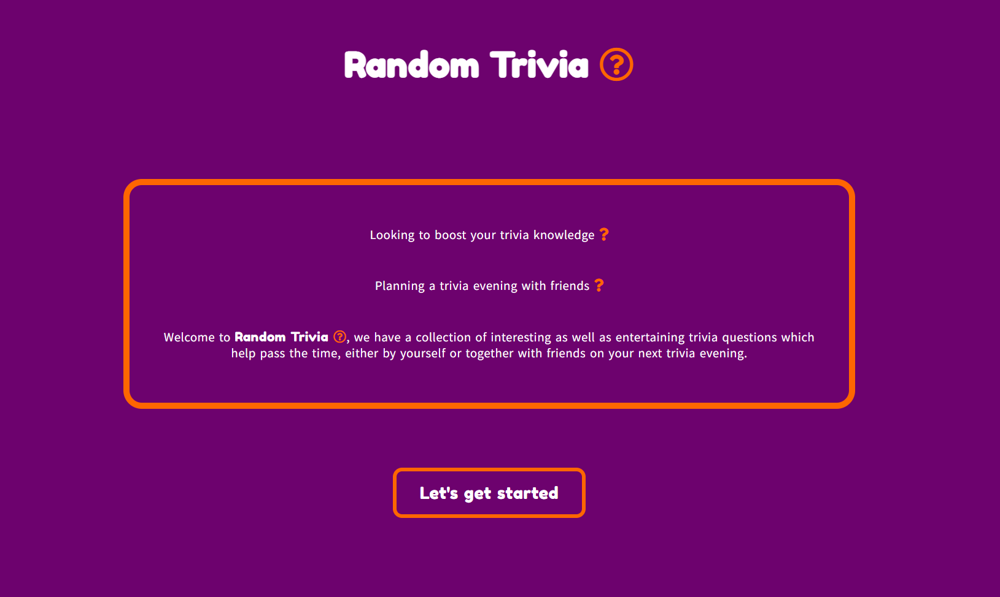

  - The "Let's get started" button highilghts when hovered over for user feedback, as will all other buttons throughout the game.

  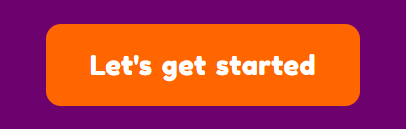

- __The Username input Section__

  - Once clicked, the "Let's get started" button triggers a function to provide the user with an text input and prompts the user to enter a username.

  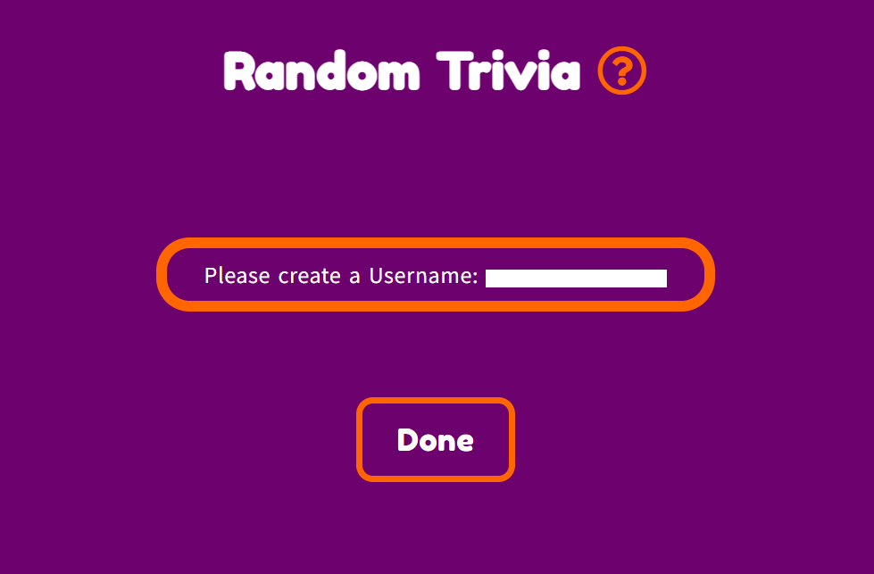

  - Once the user has entered a username it can be confirmed by clicking the "Done" button on the screen.

  

  - If the user does not enter a username then an alert will pop up on the screen informing the user that no username has been entered and a default username will be provided.

  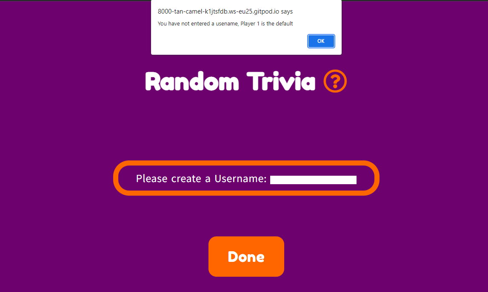

  - Once the "Done" button is clicked, it will trigger a function to provide the user a preview of their username and ask the user if they would confirm their username or re-enter a new one.
  - If the "Re-enter" button is clicked then the user will be taken back to the screen with the text input in order to re-enter a new username.
  - If the user clicks the "Confirm" button then the user will be taken to the select topic screen. 

  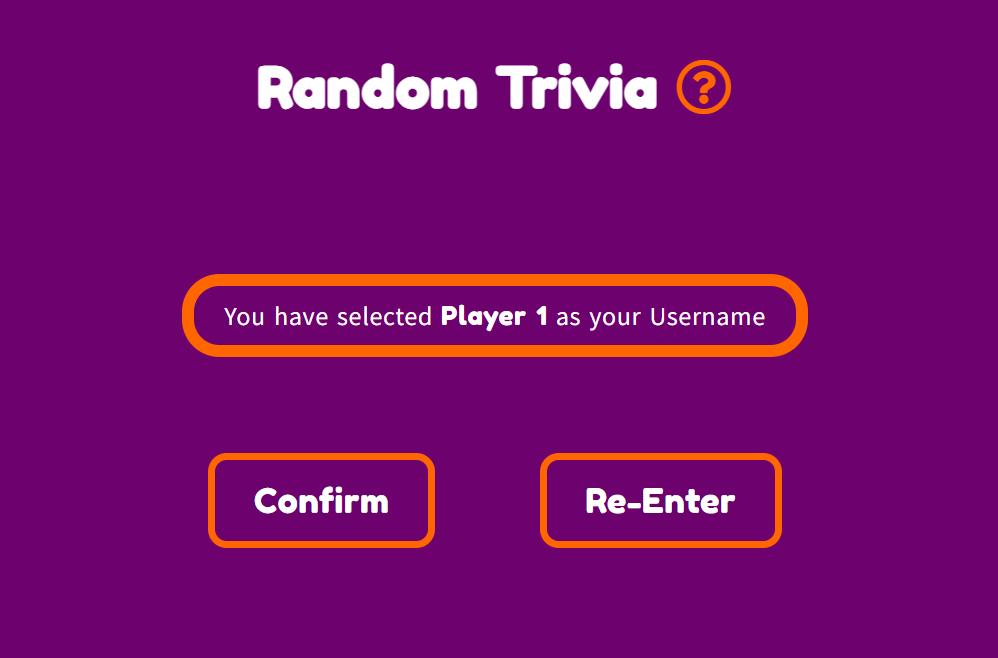

- __The Select Topic Section__

  - Once the user is on the select topic screen, then the user has a choice of three topics to choose from by means of buttons provided, namely "Movies", "General Knowledge" or "Science".

  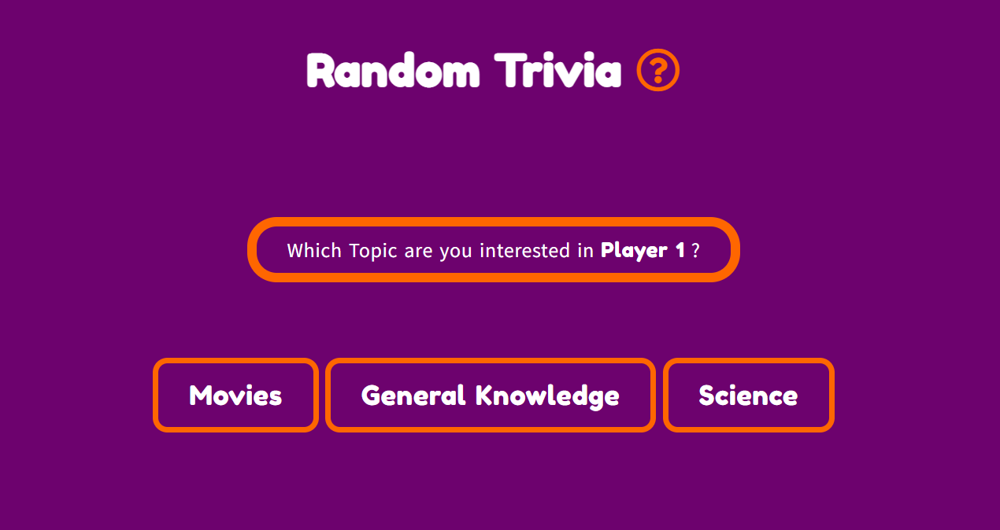

- __The Display Question Section__

  - Once the user has chosen a topic then the user will be displayed the first question from the selected topic of questons.
  - This section will display a question and provide the user with four possible answers.
  - This section also displays the user's username and indicates how many questions have been answered correctly or incorrectly.
  - There is a clearly marked button where the user can click in order to check their answer.

  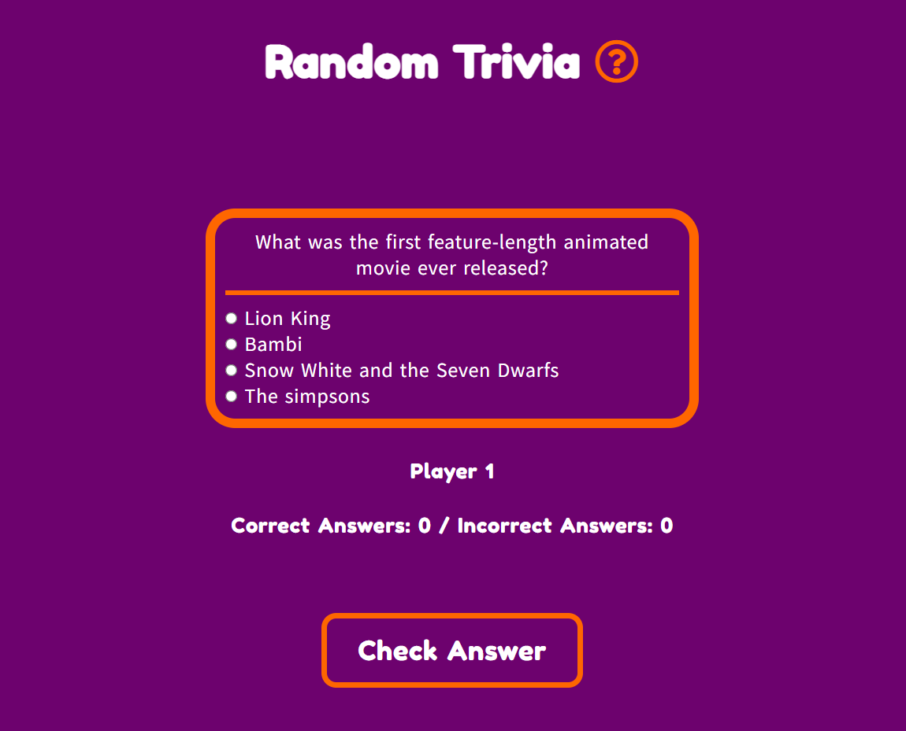

  - If the user selects the incorrect answer or no answer at all, then the game will respond with a message and inform the user of the correct answer.
  - The user is also provided a continue button in order to continue the game.

  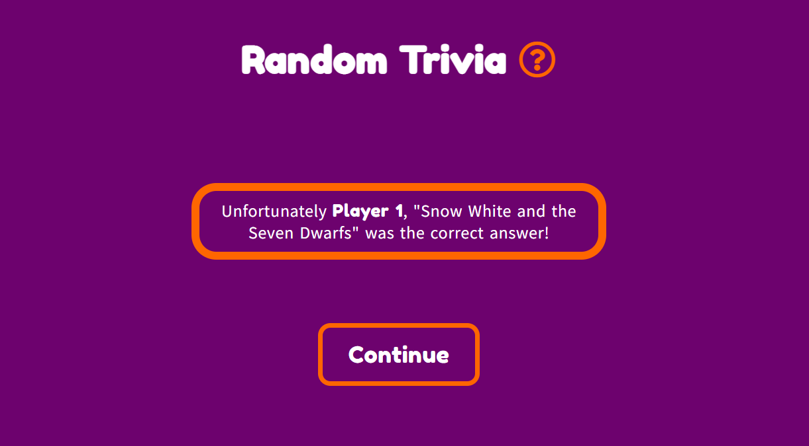

  - If the user selects the correct answer, the game will respond with a message to confirm this.
  - The user is also provided a continue button in order to continue the game.

  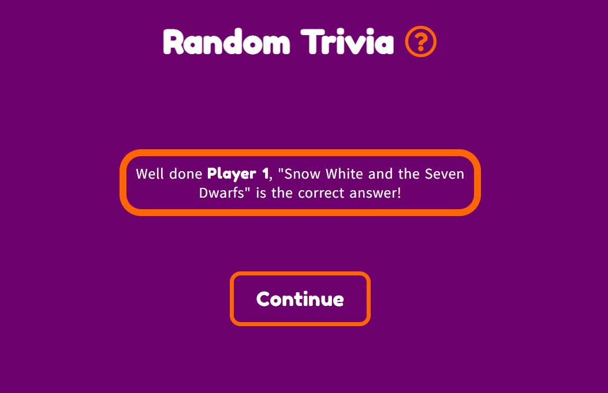

  - Whether the answer was answered correctly or not, once the user clicks on the "Continue" button, the next question will be displayed while also incrementing the relevant score of either correct or incorrect answer's answered.

  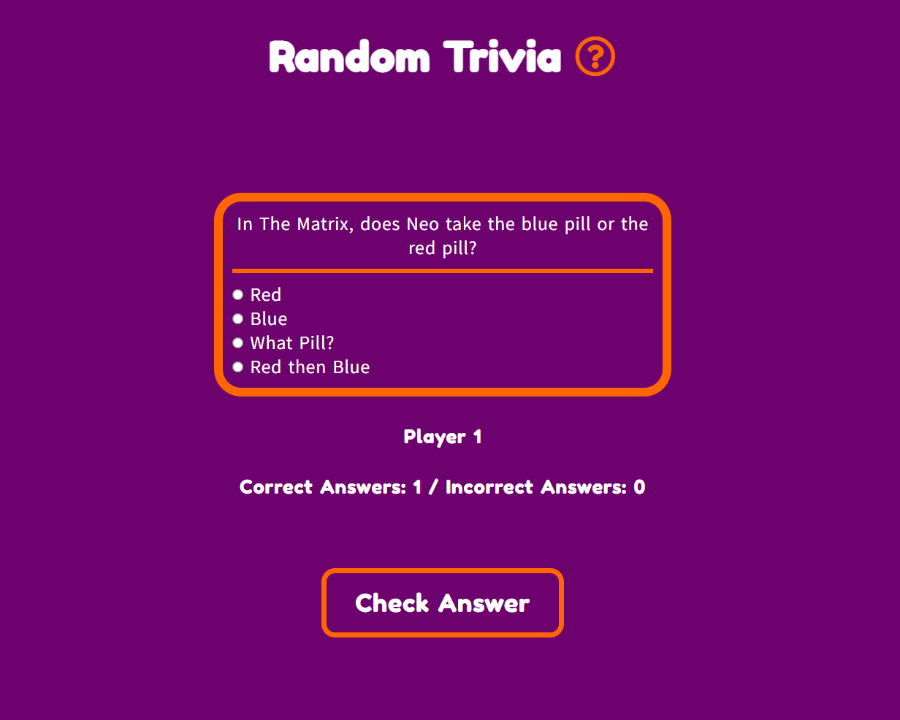

  - Once the game is done and all answers in that topic have been answered, the user will be displayed a thank you message, a result of how many questions were entered correctly and a option to start a new game.

  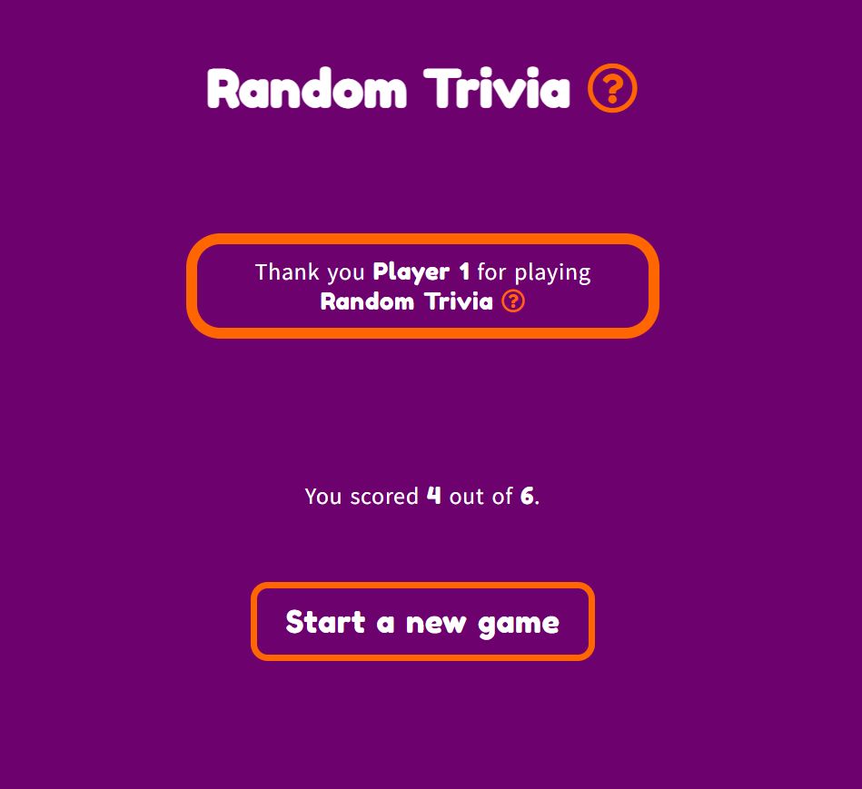

  - If the user chooses to play a new game then the user will be taken back to the choose topic display, while retaining their username.

  

### Features Left to Implement

## Testing

- Found bug with navigation menu order, it is displaying in reverse order.
  - **Resolved** by researching information on [Web Developer Diary](http://nambiara.blogspot.com/2010/10/float-right-without-changing-order.html) and applying it to my design.
- Sourced most common media breakpoint widths on [www.freecodecamp.org](https://www.freecodecamp.org/news/css-media-queries-breakpoints-media-types-standard-resolutions-and-more/.) and made the site responsive down to minimum width of 320 pixels.
  - Mobile devices: 320px — 480px
  - iPads, Tablets: 481px — 768px
  - Small screens, laptops: 769px — 1024px
  - Desktops, large screens: 1025px — 1200px
  - Extra large screens, TV: 1201px and more
- Made use of Chrome developer tools for previewing and testing new designs for media queries as well as UX aspects.

### Validator Testing

- Made use of the official [(Jigsaw) validator](https://jigsaw.w3.org/css-validator/) for the CSS file and the official [W3C validator](https://validator.w3.org/) for all HTML file testing.

#### Initial Validator Tests
- Initial validator test for index.html results:
  - Passed without any concerns or errors

- Initial validator test for style.css results:
  - Passed without any concerns or errors

- Initial validator test for script.js results:
  - Found 3 warnings.
    - **Resolved** all missing parenthesis on preventDefault functions.
    - **Resolved** 2 missing semi-colons.

#### Final Validator tests

- Final validator test for index.html results:
  - 1 Warning for the introduction section not having a heading as it was wrapped in a nav element.
    - **Resolved** by removing the outer nav element as it served no other function.

- Final validator test for balance.html results:
  - No errors or warnings found.

- Final validator test for mindfulness.html results:
  - No errors or warnings found.

- Final validator test for sign-up.html results:
  - No errors or warnings found.

- Final validator test for style.css results:
  - file validates as CSS level 3 + SVG

- Final validator test for thank-you.html results:
  - No errors or warnings found.

- All the pages of BeCentered have passed their validator testing at the time of submission.

### Unfixed Bugs

## Deployment

- BeCentered was deployed to GitHub pages, the steps were as follows:
  - While in the GitHub repository, select the settings tab.
  - Then select the Pages tab from the new menu to the left of the viewport.
  - From the source section drop down menu, select Main branch.
  - Once the main branch has been selected, the page will automatically refresh with a detailed ribbon display to indicate the successful deployment.

Here is the live link [BeCentered](https://joao4569.github.io/be-centered/)

## Deployment Testing

- Tested all internal and external links, form validation as well as responsivenes of Becentered on deployed site and all are working as intended.

## Credits

- First and foremost I would like to thank my mentor Anthony for his valuable input.

### Content

- Commit comment conventions were taken from [Freecodecamp.org](https://www.freecodecamp.org/news/writing-good-commit-messages-a-practical-guide/), I do not totally understand all the vernacular but tried my best to implement it as best I could.
- Font pairing taken from example seen on [typ.io](https://typ.io/fonts/fredoka_one), after deciding to use the Fredoka One font as my headings' font.
- Font icons sourced on [fontawesome.com](https://fontawesome.com/v5.15/icons?d=gallery&p=2&q=question&m=free).

### Media

- All images sourced from [Pexels](https://www.pexels.com).
- Hero image sizing suggestions sourced on [Hubspot](https://blog.hubspot.com/marketing/hero-image).
- Information for optimizing images for web design found on [jimdo](https://www.jimdo.com/blog/optimize-website-images-for-better-design-seo/).
- All images on Becentered were resized using [TinyPNG](https://tinypng.com/).
- Code for Hero image zoom animation taken directly from "Love Running" walkthrough project.
- Method for embedding Youtube video learnt on [GeeksforGeeks](https://www.geeksforgeeks.org/html-adding-youtube-videos/).
- Learn about object-fit CSS property on [MDN web docs](https://developer.mozilla.org/en-US/docs/Web/CSS/object-fit).